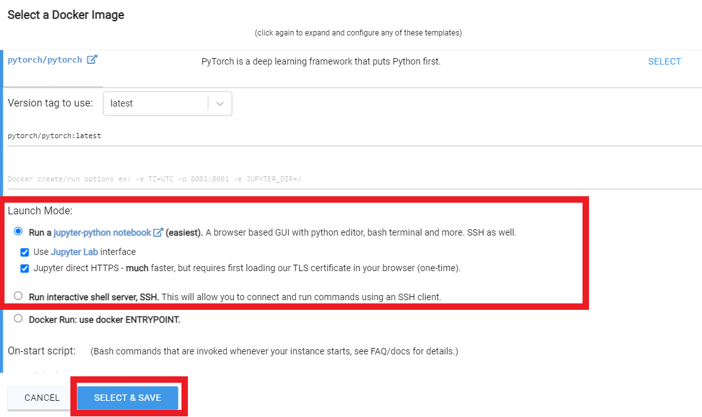
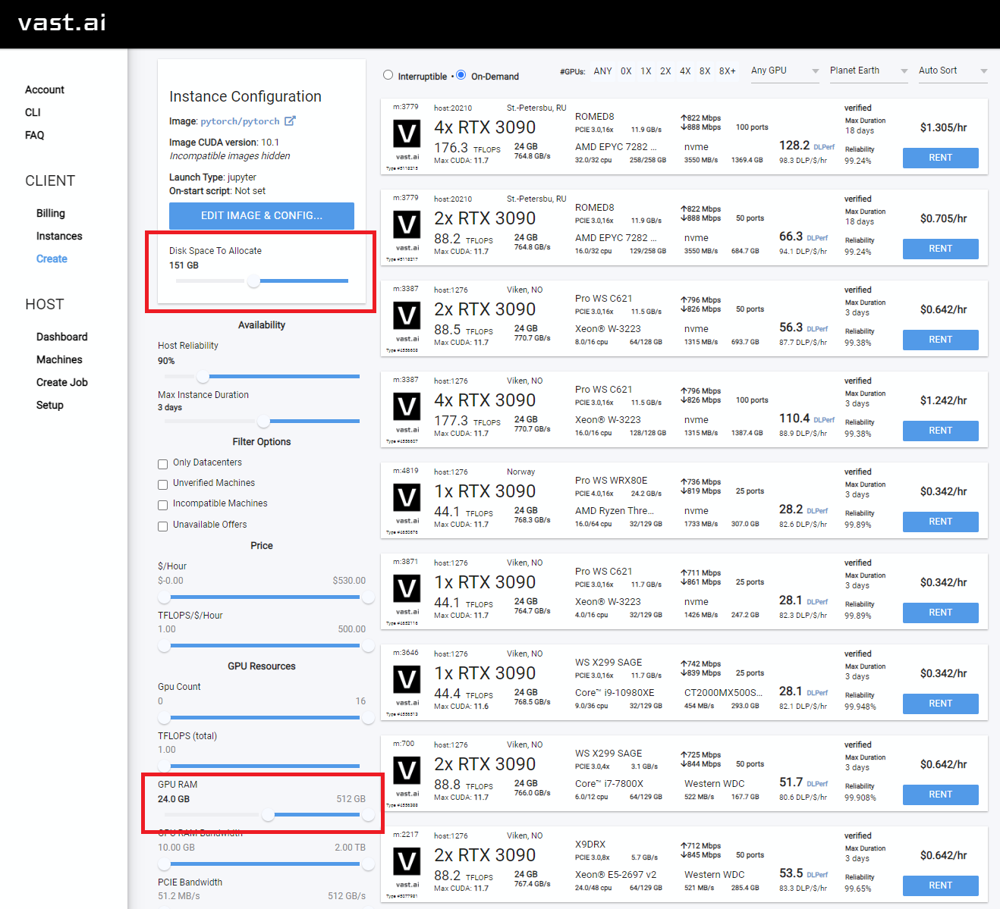
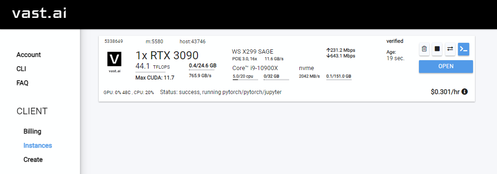
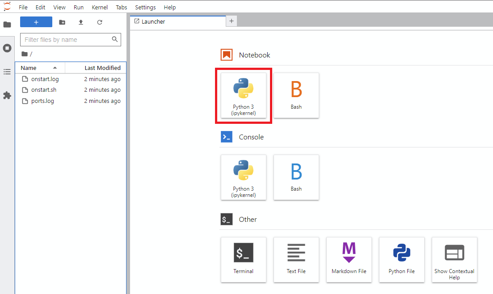
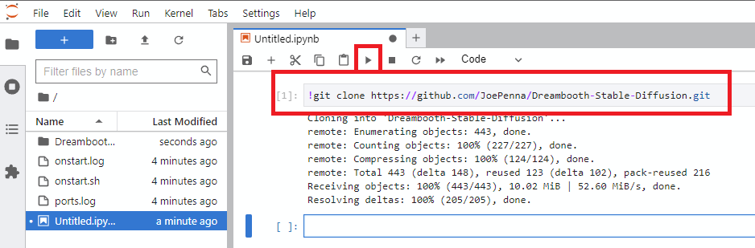
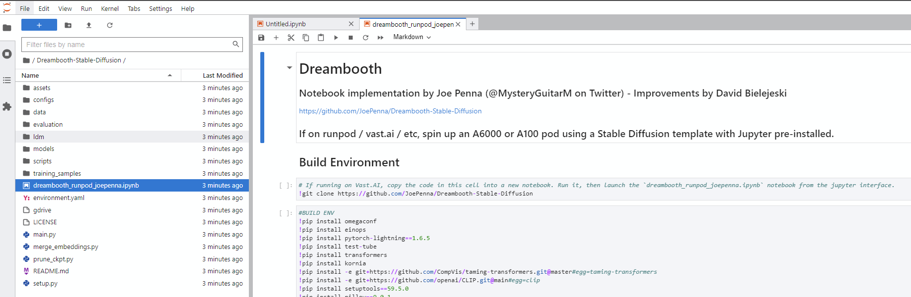
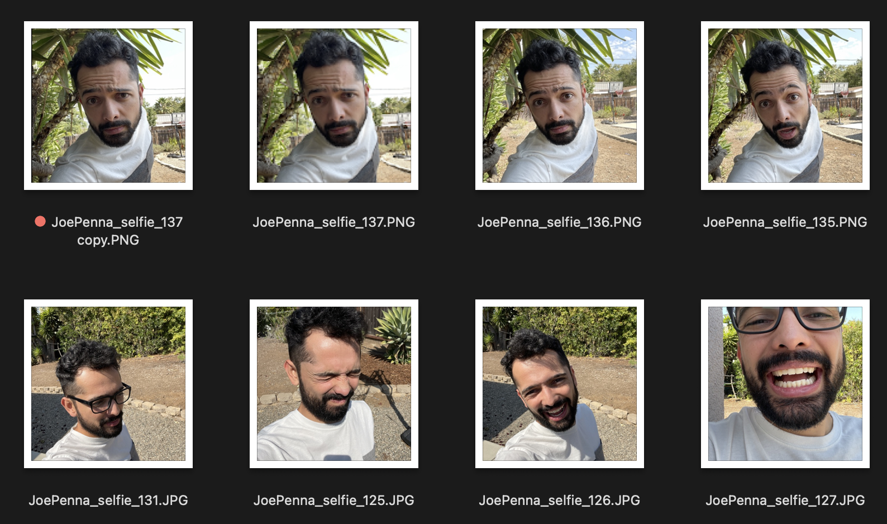
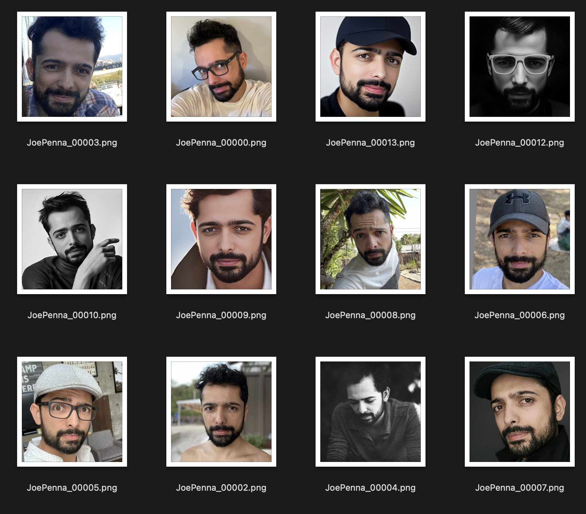

# Index

- [Notes by Joe Penna](#notes-by-joe-penna)
- [Setup](#setup)
  - [Easy RunPod Instructions](#easy-runpod-instructions)
  - [Vast.AI Setup](#vast-ai-setup)
- [Textual Inversion vs. Dreambooth](#text-vs-dreamb)
- [Using the Generated Model](#using-the-generated-model)
- [Debugging Your Results](#debugging-your-results)
  - [They don't look like you at all!](#they-dont-look-like-you)
  - [They sorta look like you, but exactly like your training images](#they-sorta-look-like-you-but-exactly-like-your-training-images)
  - [They look like you, but not when you try different styles](#they-look-like-you-but-not-when-you-try-different-styles)
- [Hugging Face Diffusers](#hugging-face-diffusers)

# The Repo Formerly Known As "Dreambooth"
## ...now more accurately described as "Unfrozen Model Textual Inversion for Stable Diffusion"


## <a name="notes-by-joe-penna"></a>  Notes by Joe Penna
### **INTRODUCTIONS!**
Hi! My name is Joe Penna.

You might have seen a few YouTube videos of mine under *MysteryGuitarMan*. I'm now a feature film director. You might have seen [ARCTIC](https://www.youtube.com/watch?v=N5aD9ppoQIo&t=6s) or [STOWAWAY](https://www.youtube.com/watch?v=A_apvQkWsVY).

For my movies, I need to be able to train specific actors, props, locations, etc. So, I did a bunch of changes to @XavierXiao's repo in order to train people's faces.

I can't release all the tests for the movie I'm working on, but when I test with my own face, I release those on my Twitter page - [@MysteryGuitarM](https://twitter.com/MysteryGuitarM).

Lots of these tests were done with a buddy of mine -- Niko from CorridorDigital. It might be how you found this repo!

I'm not really a coder. I'm just stubborn, and I'm not afraid of googling. So, eventually, some really smart folks joined in and have been contributing. In this repo, specifically: @djbielejeski @gammagec @MrSaad –– but so many others in our Discord!

This is no longer my repo. This is the people-who-wanna-see-Dreambooth-on-SD-working-well's repo!

Now, if you wanna try to do this... please read the warnings below first:

### **WARNING!**
- **This is bleeding edge stuff**... there is currently no easy way to run this. This repo is based on a repo based on another repo.
  - At the moment, it takes a LOT of effort to create something that's basically duct tape and bubble gum -- but eventually works SUPER well.
  - Step in, please! Don't let that scare ya -- but please know that you're wading through the jungle at night, with no torch...

- Unfreezing the model takes a lot of juice.
  - ~~You're gonna need an A6000 / A40 / A100 (or similar top-of-the-line thousands-of-dollars GPU).~~
  - You can now run this on a GPU with 24GB of VRAM (e.g. 3090). Training will be slower, and you'll need to be sure this is the *only* program running.
  - If, like myself, you don't happen to own one of those, I'm including a Jupyter notebook here to help you run it on a rented cloud computing platform. 
  - It's currently tailored to [runpod.io](https://runpod.io?ref=n8yfwyum), but can work on [vast.ai](#vast-ai-setup) / etc.
  
- This implementation does not fully implement Google's ideas on how to preserve the latent space.

  - Most images that are similar to what you're training will be shifted towards that.
  - e.g. If you're training a person, all people will look like you. If you're training an object, anything in that class will look like your object.

- There doesn't seem to be an easy way to train two subjects consecutively. You will end up with an `11-12GB` file before pruning.
  - The provided notebook has a pruner that crunches it down to `~2gb`
  
- Best practice is to change the token to a celebrity name. Here's [my wife trained with the exact same settings, except for the token](#using-the-generated-model)


# <a name="setup"></a> Setup
## <a name="easy-runpod-instructions"></a> Easy RunPod Instructions
- Sign up for RunPod. Feel free to use my [referral link here](https://runpod.io?ref=n8yfwyum), so that I don't have to pay for it (but you do).
- Click **Deploy** on either `SECURE CLOUD` or `COMMUNITY CLOUD`
- Follow these video instructions here:

[](https://www.youtube.com/watch?v=7m__xadX0z0#t=5m33.1s)

## <a name="vast-ai-setup"></a>  Vast.AI Instructions
- Sign up for [Vast.AI](https://vast.ai/)
- Add some funds (I typically add them in $10 increments)
- Navigate to the [Client - Create page](https://vast.ai/console/create/)
  - Select pytorch/pytorch as your docker image, and the buttons "Use Jupyter Lab Interface" and "Jupyter direct HTTPS"
  - 
- You will want to increase your disk space, and filter on GPU RAM (12gb checkpoint files + 4gb model file + regularization images + other stuff adds up fast)
  - I typically allocate 150GB
  - 
  - Also good to check the Upload/Download speed for enough bandwidth so you don't spend all your money waiting for things to download.
- Select the instance you want, and click `Rent`, then head over to your [Instances](https://vast.ai/console/instances/) page and click `Open`
  - 
  - You will get an unsafe certificate warning. Click past the warning or install the [Vast cert](https://vast.ai/static/jvastai_root.cer).
- Click `Notebook -> Python 3` (You can do this next step a number of ways, but I typically do this)
  - 
- Clone Joe's repo with this command
  - `!git clone https://github.com/JoePenna/Dreambooth-Stable-Diffusion.git`
  - Click `run`
  - 
- Navigate into the new `Dreambooth-Stable-Diffusion` directory on the left and open the `dreambooth_runpod_joepenna.ipynb` file
  - 
- Follow the instructions in the workbook and start training

# <a name="text-vs-dreamb"></a>  Textual Inversion vs. Dreambooth
The majority of the code in this repo was written by Rinon Gal et. al, the authors of the Textual Inversion research paper.

A few bits about regularization images were added that we all thought were super important -- all the researchers included!

...until my images were trained under the class "dog":
<br>

...and under the nonsensical class "§¶•" instead of "man" or "woman" or "person":
<br>

...and with completely blank regularization images:
<br>

And here's what `"photograph of an apple"` looked like before I messed with code a bit:
<br>

We're not realizing the "regularization class" bits of this code have no effect, and that there is little to no prior preservation loss.

So, out of respect to both the MIT team and the Google researchers, I'm renaming this fork to:
*"Unfrozen Model Textual Inversion for Stable Diffusion"*.

For an alternate implementation that attempts prior loss preservation, please see ["Alternate Option"](#hugging-face-diffusers) below.


# <a name="using-the-generated-model"></a> Using the generated model
The `ground truth` (real picture, caution: very beautiful woman)
<br>

Same prompt for all of these images below:

| `sks` | `woman` | `Natalie Portman` | `Kate Mara` |
| ----- | ------- | ----------------- | ----------- |
|  |  |  |  |   

# <a name="debugging-your-results"></a> Debugging your results
### ❗❗ THE NUMBER ONE MISTAKE PEOPLE MAKE ❗❗

**Prompting with just your token. ie "joepenna" instead of "joepenna person"**


If you trained with `joepenna` under the class `person`, the model should only know your face as:

```
joepenna person
```

Example Prompts:

🚫 Incorrect (missing `person` following `joepenna`)
```
portrait photograph of joepenna 35mm film vintage glass
```

✅ This is right (`person` is included after `joepenna`)
```
portrait photograph of joepenna person 35mm film vintage glass
```

You might sometimes get someone who kinda looks like you with joepenna (especially if you trained for too many steps), but that's only because this current iteration of Dreambooth overtrains that token so much that it bleeds into that token.

---

#### ☢ Be careful with the types of images you train

While training, Stable doesn't know that you're a person. It's just going to mimic what it sees.

So, if these are your training images look like this:



You're only going to get generations of you outside next to a spiky tree, wearing a white-and-gray shirt, in the style of... well, selfie photograph.

Instead, this training set is much better:



The only thing that is consistent between images is the subject. So, Stable will look through the images and learn only your face, which will make "editing" it into other styles possible.

## Oh no! You're not getting good generations!

#### <a name="they-dont-look-like-you"></a> OPTION 1: They're not looking like you at all! (Train longer, or get better training images)

Are you sure you're prompting it right?

It should be `<token> <class>`, not just `<token>`. For example:

`JoePenna person, portrait photograph, 85mm medium format photo`


If it still doesn't look like you, you didn't train long enough.

----

#### <a name="they-sorta-look-like-you-but-exactly-like-your-training-images"></a> OPTION 2: They're looking like you, but are all looking like your training images. (Train for less steps, get better training images, fix with prompting)

Okay, a few reasons why: you might have trained too long... or your images were too similar... or you didn't train with enough images.

No problem. We can fix that with the prompt. Stable Diffusion puts a LOT of merit to whatever you type first. So save it for later:

`an exquisite portrait photograph, 85mm medium format photo of JoePenna person with a classic haircut`


----

#### <a name="they-look-like-you-but-not-when-you-try-different-styles"></a> OPTION 3: They're looking like you, but not when you try different styles. (Train longer, get better training images)

You didn't train long enough...

No problem. We can fix that with the prompt:

`JoePenna person in a portrait photograph, JoePenna person in a 85mm medium format photo of JoePenna person`


### More tips and help here: [Stable Diffusion Dreambooth Discord](https://discord.com/invite/qbMuXBXyHA)

# <a name="hugging-face-diffusers"></a> Hugging Face Diffusers - Alternate Option

Note: This is a diffuser implementation, and use is much more complicated than using a *.ckpy file.

At the moment, there is no way to use the diffusers model with most repos (e.g. AUTOMATIC1111, HLKY, DeForum, etc)

Dreambooth is now supported in Hugging Face diffusers for training with stable diffusion, try it out in the colab:

[](https://colab.research.google.com/github/huggingface/notebooks/blob/main/diffusers/sd_dreambooth_training.ipynb)
