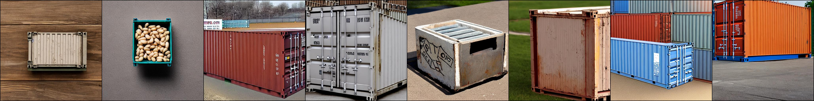
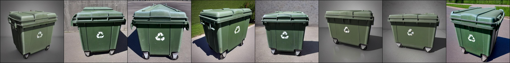
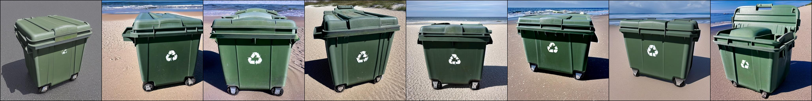
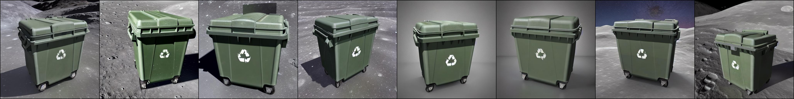
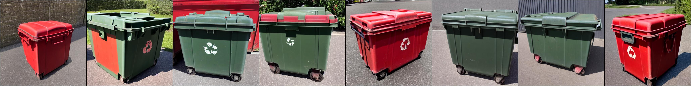
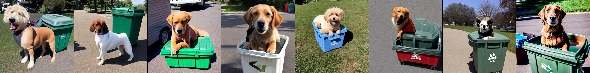

# "Dreambooth" on Stable Diffusion


## Notes by Joe Penna
### **INTRODUCTIONS!**
Hi! My name is Joe Penna.

You might have seen a few YouTube of mine under *MysteryGuitarMan*. I'm now a feature filmmaker. You might have seen [ARCTIC](https://www.youtube.com/watch?v=N5aD9ppoQIo&t=6s) or [STOWAWAY](https://www.youtube.com/watch?v=A_apvQkWsVY).

For my movies, I need to be able to train specific actors, props, locations, etc. So, I did a bunch of changes to @XavierXiao's repo in order to train people's faces.

I can't release all the tests for the movie I'm working on, but when I test with my own face, I release those on my Twitter page - [@MysteryGuitarM](https://twitter.com/MysteryGuitarM).

Lots of these tests were done with a buddy of mine -- Niko from CorridorDigital. It might be how you found this repo!

I'm not really a coder. I'm just stubborn, and I'm not afraid of googling. So, eventually, some really smart folks joined in and have been contributing. In this repo, specifically: @djbielejeski @gammagec @MrSaad –– but so many others in our Discord!

This is no longer my repo. This is the people-who-wanna-see-Dreambooth-on-SD-working-well's repo!

Now, if you wanna try to do this... please read the warnings below first:

### **WARNINGS!**
- **This is bleeding edge stuff**... there is currently no easy way to run this. This repo is based on a repo based on another repo.
  - At the moment, it takes a LOT of effort to create something that's basically duct tape and bubble gum -- but eventually works SUPER well.
  - Step in, please! Don't let that scare ya -- but please know that you're wading through the jungle at night, with no torch...

- Unfreezing the model takes a lot of juice.
  - ~~You're gonna need an A6000 / A40 / A100 (or similar top-of-the-line thousands-of-dollars GPU).~~
  - You can now run this on a GPU with 24GB of VRAM (e.g. 3090). Training will be slower, and you'll need to be sure this is the *only* program running.
  - If, like myself, you don't happen to own one of those, I'm including a Jupyter notebook here to help you run it on a rented cloud computing platform. 
  - It's currently tailored to [runpod.io](https://runpod.io?ref=n8yfwyum), but can work on vast.ai / etc.
  
- This implementation does not fully implement Google's ideas on how to preserve the latent space.

  - Most images that are similar to what you're training will be shifted towards that.
  - e.g. If you're training a person, all people will look like you. If you're trianing an object, anything in that class will look like your object.

- There doesn't seem to be an easy way to train two subjects consecutively. You will end up with an 11-12GB.
  - I'm currently testing ways of compressing that down to ~2GB.
  
- You might have better luck training with `sd-v1-4-full-ema.ckpt`
  - However, it's huge and it's annoying.
  
# Vast.AI Instructions
- Sign up for [Vast.AI](https://vast.ai/) 
- Add some funds (I typically add them in $10 increments)
- Navigate to the [Client - Create page](https://vast.ai/console/create/)
  - Select pytorch/pytorch as your docker image, and select "Use Jupyter Lab Interface"
  - 
- You will want to increase your disk space, and filter on GPU RAM (12gb checkpoint files + 4gb model file + regularization images + other stuff adds up fast)
  - I typically allocate 150GB
  - 
  - Also good to check the Upload/Download speed for enough bandwidth so you don't spend all your money waiting for things to download.
- Select the instance you want, and click `Rent`, then head over to your [Instances](https://vast.ai/console/instances/) page and click `Open`
  - 
- Click `Notebook -> Python 3` (You can do this next step a number of ways, but I typically do this)
  - 
- Clone Joe's repo with this command
  - `!git clone https://github.com/JoePenna/Dreambooth-Stable-Diffusion.git`
  - Click `run`
  - 
- Navigate into the new `Dreambooth-Stable-Diffusion` directory on the left and open the `dreambooth_runpod_joepenna.ipynb` file
  - 
- Follow the instructions in the workbook and start training

# RunPod Instructions
- Sign up for RunPod. Feel free to use my [referral link here](https://runpod.io?ref=n8yfwyum), so that I don't have to pay for it (but you do).
- Click **Deploy** on either `SECURE CLOUD` or `COMMUNITY CLOUD`
- Click `Select` on a GPU with at least 35 GB of VRAM (e.g. A100, A40, A6000, etc)
- Select a template > `Runpod / Stable Diffusion`
- Click `Connect` and choose `Jupyter Lab`
- Make a new notebook (it's just like Google Colab) and run the code below
```python
!git clone https://github.com/JoePenna/Dreambooth-Stable-Diffusion/
```
- With the file navigator on the left, `/workspace/Dreambooth-Stable-Diffusion/dreambooth_runpod_joepenna.ipynb` -- follow the instructions in there.

# Original Readme from XavierXiao

This is an implementtaion of Google's [Dreambooth](https://arxiv.org/abs/2208.12242) with [Stable Diffusion](https://github.com/CompVis/stable-diffusion). The original Dreambooth is based on [Imagen](https://imagen.research.google/) text-to-image model. However, neither the model nor the pre-trained weights of Imagen is available. To enable people to fine-tune a text-to-image model with a few examples, I implemented the idea of Dreambooth on Stable diffusion.

This code repository is based on that of [Textual Inversion](https://github.com/rinongal/textual_inversion). Note that Textual Inversion only optimizes word ebedding, while dreambooth fine-tunes the whole diffusion model.

The implementation makes minimum changes over the official codebase of Textual Inversion. In fact, due to lazyness, some components in Textual Inversion, such as the embedding manager, are not deleted, although they will never be used here.
## Update
**9/20/2022**: I just found a way to reduce the GPU memory a bit. Remember that this code is based on Textual Inversion, and TI's code base has [this line](https://github.com/rinongal/textual_inversion/blob/main/ldm/modules/diffusionmodules/util.py#L112), which disable gradient checkpointing in a hard-code way. This is because in TI, the Unet is not optimized. However, in Dreambooth we optimize the Unet, so we can turn on the gradient checkpoint pointing trick, as in the original SD repo [here](https://github.com/CompVis/stable-diffusion/blob/main/ldm/modules/diffusionmodules/util.py#L112). The gradient checkpoint is default to be True in [config](https://github.com/XavierXiao/Dreambooth-Stable-Diffusion/blob/main/configs/stable-diffusion/v1-finetune_unfrozen.yaml#L47). I have updated the codes.
## Usage

### Preparation
First set-up the ```ldm``` enviroment following the instruction from textual inversion repo, or the original Stable Diffusion repo.

To fine-tune a stable diffusion model, you need to obtain the pre-trained stable diffusion models following their [instructions](https://github.com/CompVis/stable-diffusion#stable-diffusion-v1). Weights can be downloaded on [HuggingFace](https://huggingface.co/CompVis). You can decide which version of checkpoint to use, but I use ```sd-v1-4-full-ema.ckpt```.

We also need to create a set of images for regularization, as the fine-tuning algorithm of Dreambooth requires that. Details of the algorithm can be found in the paper. Note that in the original paper, the regularization images seem to be generated on-the-fly. However, here I generated a set of regularization images before the training. The text prompt for generating regularization images can be ```photo of a <class>```, where ```<class>``` is a word that describes the class of your object, such as ```dog```. The command is

```
python scripts/stable_txt2img.py --ddim_eta 0.0 --n_samples 8 --n_iter 1 --scale 10.0 --ddim_steps 50  --ckpt /path/to/original/stable-diffusion/sd-v1-4-full-ema.ckpt --prompt "a photo of a <class>" 
```

I generate 8 images for regularization, but more regularization images may lead to stronger regularization and better editability. After that, save the generated images (separately, one image per ```.png``` file) at ```/root/to/regularization/images```.

**Updates on 9/9**
We should definitely use more images for regularization. Please try 100 or 200, to better align with the original paper. To acomodate this, I shorten the "repeat" of reg dataset in the [config file](https://github.com/XavierXiao/Dreambooth-Stable-Diffusion/blob/main/configs/stable-diffusion/v1-finetune_unfrozen.yaml#L96).

For some cases, if the generated regularization images are highly unrealistic (happens when you want to generate "man" or "woman"), you can find a diverse set of images (of man/woman) online, and use them as regularization images.

### Training
Training can be done by running the following command

```
python main.py --base configs/stable-diffusion/v1-finetune_unfrozen.yaml 
                -t 
                --actual_resume /path/to/original/stable-diffusion/sd-v1-4-full-ema.ckpt  
                -n <job name> 
                --gpus 0, 
                --data_root /root/to/training/images 
                --reg_data_root /root/to/regularization/images 
                --class_word <xxx>
```

Detailed configuration can be found in ```configs/stable-diffusion/v1-finetune_unfrozen.yaml```. In particular, the default learning rate is ```1.0e-6``` as I found the ```1.0e-5``` in the Dreambooth paper leads to poor editability. The parameter ```reg_weight``` corresponds to the weight of regularization in the Dreambooth paper, and the default is set to ```1.0```.

Dreambooth requires a placeholder word ```[V]```, called identifier, as in the paper. This identifier needs to be a relatively rare tokens in the vocabulary. The original paper approaches this by using a rare word in T5-XXL tokenizer. For simplicity, here I just use a random word ```sks``` and hard coded it.. If you want to change that, simply make a change in [this file](https://github.com/XavierXiao/Dreambooth-Stable-Diffusion/blob/main/ldm/data/personalized.py#L10).

Training will be run for 800 steps, and two checkpoints will be saved at ```./logs/<job_name>/checkpoints```, one at 500 steps and one at final step. Typically the one at 500 steps works well enough. I train the model use two A6000 GPUs and it takes ~15 mins.

### Generation
After training, personalized samples can be obtained by running the command

```
python scripts/stable_txt2img.py --ddim_eta 0.0 
                                 --n_samples 8 
                                 --n_iter 1 
                                 --scale 10.0 
                                 --ddim_steps 100  
                                 --ckpt /path/to/saved/checkpoint/from/training
                                 --prompt "photo of a sks <class>" 
```

In particular, ```sks``` is the identifier, which should be replaced by your choice if you happen to change the identifier, and ```<class>``` is the class word ```--class_word``` for training.

## Results
Here I show some qualitative results. The training images are obtained from the [issue](https://github.com/rinongal/textual_inversion/issues/8) in the Textual Inversion repository, and they are 3 images of a large trash container. Regularization images are generated by prompt ```photo of a container```. Regularization images are shown here:



After training, generated images with prompt ```photo of a sks container```:



Generated images with prompt ```photo of a sks container on the beach```:



Generated images with prompt ```photo of a sks container on the moon```:



Some not-so-perfect but still interesting results:

Generated images with prompt ```photo of a red sks container```:



Generated images with prompt ```a dog on top of sks container```:



